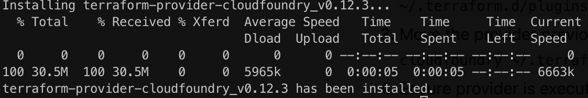
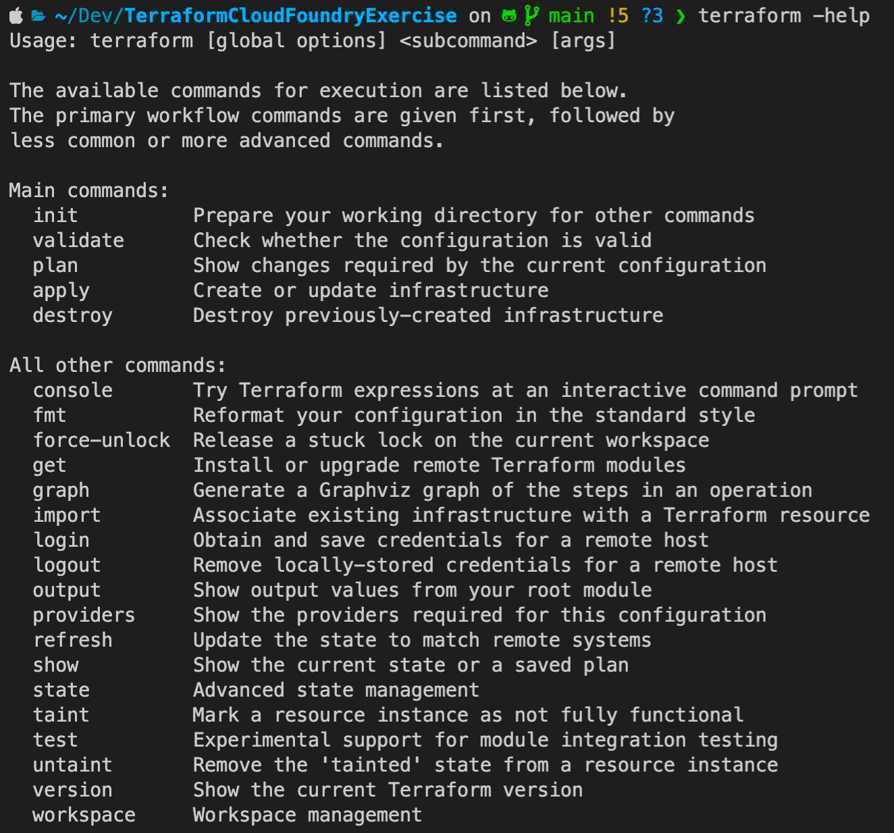

# Introduction


Why Terraform? DevOps is transforming the way we run software, the benefits of _infrastructure as code_ is becoming more obvious in how we can provision entire environments without manually needing to do anything, with tests and debugging to help setup idempotence, conventions and distibution in all environments. There is also a concept known as _configuration drift_, where an environment differs from others, and will end up as a snowflake server. As the company grows, this will become more problematic.

_Statistically_, companies that apply good DevOps practises increase the number of features delivered by 100%, reduce lead times (the time coming up with an idea to running code in production) by 60%, and reduce production incidents by 60 to 90%.

This is at the heart of chaos engineering and also a very good way of documenting and versioning with speed, safely and reliably. 

Cloudfoundry is the provider I am using, but as you know will be [discontinued](https://techcrunch.com/2021/12/27/whats-next-for-cloud-foundry/) soon. This is my provider and reason for doing this exercise currently, but the same rules can be applied to other providers.

# Get Started with Terraform and cloudfoundry

Learn Terraform and Cloudfoundry, an excuse for me to learn Terraform and to solve an infrastructure consistency problem I have been experiencing with an environment I have been developing on.

### Steps for getting started

1. ##### **Download** Terraform from https://www.terraform.io/downloads

   ```bash
   brew tap hashicorp/tap
   brew install hashicorp/tap/terraform
   terraform --version	# >Terraform v1.2.4 on darwin_amd64
   ```

2. Download **cloud foundry [terraform provider](https://github.com/cloudfoundry-community/terraform-provider-cloudfoundry)** which can be done at https://github.com/cloudfoundry-community/terraform-provider-cloudfoundry/wiki like below or do it manually based on the

   ```bash
   bash -c "$(curl -fsSL https://raw.github.com/cloudfoundry-community/terraform-provider-cloudfoundry/master/bin/install.sh)"
   ```

   

3. Initialise cloudfoundry provider `terraform init`

4. Setup an IDE like IntelliJ or _VSCode_ with terraform plugins and syntax highlighting

   

### Why Terraform(Tf)?

- **I**nfrastructure **A**s **C**ode represents a mindset of executing code to _define_, _deploy, update and destroy infrastructure_
- There are 5 categories of IAC tools
  - **Adhoc scripts** - Bash, Ruby, Python, Powershell
  - **Configuration management tools** - Chef, Puppet, Ansible and SaltStack
  - **Server templating tools** - Docker, Packer, Vagrant, Virtual Machines or Containers (Immutable infrastructure)
  - **Orchestration tools** - Kubernetes, Marathon, Mesos, Amazon ECS, Docker Swarn or a Pod of Dockers and Nomad
  - **Provisioning tools** - Terraform, Cloud-Formation and Openstack Heat
- Terraform is written in Go, makes API calls to the relevant **API translating** one or more _providers_ consistently, defining entire infrastructure - servers, databases using **H**ashiCorp **C**onfiguration **L**anguage
- What **Terraform is not**, an easy way to just swap between different cloud providers with the same settings, mainly because providers offer different solutions (no easy way to transparently port from one to another)
- Terraform uses a **declarative** approach, meaning it declares how the _desired state_ or end result, where as Puppet uses a **procedural** approach, so it may change what exists versus what you knewly configured
- Procedural approaches also do not take into the account the state and history of the infrastructure, but the down side is that declaritive has no concept of _zero-downtime deployments_ but clever hacks to solve this
- Tf is one of the youngest IaC tools, making it the least mature

### Getting started with Terraform

- The extension is <file>.tf calling **provider**s like AWS, Azure and [Cloudfoundry](https://github.com/cloudfoundry-community/terraform-provider-cloudfoundry/blob/master/docs/index.md) `provider "<NAME>"`

  ```haskell
  provider "cloudfoundry" {
  		[CONFIG ...]
  }
  ```

  

- For each type of provider **resource**s the provider type and name `resource "<PROVIDER_TYPE>" "<NAME>"`

  ```haskell
  resource "cloudfoundry_space" "s1" {
      [CONFIG ...]
  }
  ```

- **Reference**s allow you to access other parts of the code `<PROVIDER>_<TYPE>.<NAME>.<ATTRIBUTE>`

- **Variable**s `variable "<NAME>" {[CONFIG ...]}` and configure some information about the variable like below, and type can consist of a *string, number, bool, list, map, set, object, tuple and any* 

  ```haskell
  variable "api_url" {
      description = "API URL"
      type = string
      default = "https://api.london.uk"
  }
  var.api_url
  ```

- **Data** source, like resource but the name is used as an identifier `data "<PROVIDER_TYPE>" "<NAME>" {[CONFIG ...]}`

  ```haskell
  data "cloudfoundry_app" "my-app" {
      name_or_id = "my-app"
      space      = "space-id"
  }
  data.my_app.buildpack
  ```

- **Output** variables `output "NAME" { value = "<PATH>"}`

  ```haskell
  output "s3_bucket_arn" {
    value       = aws_s3_bucket.terraform_state.arn
    description = "The ARN of the S3 bucket"
  }
  ```

- **Terraform Actions** `terraform -help`

  - `terraform init` Initialise within the folder

  - `terraform validate` check configuration

  - `terraform plan` Run assigning variable values and see what will happen without making any changes

  - `terraform apply` This create or update existing

  - `terraform destroy` Destroy previous infrastructure or cleanup, no undo in production and will destroy all resources, so don't do this in production

  - `terraform graph` Create a dependency graph to see what you create

    

- **Note** Tf keeps track of the **state** or resources that are already deployed. Setup gitignore if you don't want that stored in GIT

  

### How to manage Terraform state

- Every time terraform is applied, it records information about the **infrastructure** to *terraform.tfstate* file

- The state file is a private API (only used internally) and should very rarly be manipulated

- In a team dynamic, utilise **lock file**s

- *Don't* store state in **source control**, will share secrets and other as open text

- Configure **remote backends** with *secrets* to store thislike S3 (Simple storage service 99.99% availibilty and durability)

  - ***Limitation*** is a chicken-and-egg situation where this needs to be divided into two steps and same when deleting

- Seperate terraform files to help debug issues, placing in seperate folders or files and **Isolate** via workspaces or file layout

  ```bash
  terraform workspace new workspace1
  terraform wokspace list #defaut workspace1
  ```

### How to create reusable infrastructure with terraform modules

- Need at least two nearly identical **environments**, *staging* and *production*

- **Module**s are any files in a folder is a module `module "<NAME>" {sourc = "<SOURCE>"}`

  ```haskell
  module "web_cluster" {
    cluster_name  = var.cluster_name
    instance_type = "m4.large"
    ...
  }
  
  resource "aws_autoscaling_schedule" "scale_out_during_business_hours" {
    scheduled_action_name  = "scale-out-during-business-hours"
  	...
    autoscaling_group_name = module.web_cluster.asg_name
  }
  ```

- Module **locals** by referencing `local.<name>` `locals{<key> = <value>}`

  ```haskell
  locals {
    tcp_protocol = "tcp"
    all_ips      = ["0.0.0.0/0"]
  }
  
  resource "aws_security_group_rule" "allow_server_http_inbound" {
    type              = "ingress"
    ...
    protocol    = local.tcp_protocol
    cidr_blocks = local.all_ips
  }
  ```

- **Module versioning** can also be done by referencing the module source=<url>?ref=v<major>.<minor>.<patch>

- Advantage of this entire section will be to defined best practises, version stuff for testing by semantically versioning, making this easier to work within teams

### Tips, tricks, loops, If statements, Deployment and Gotchas

- Pg 133 ...

### How to test Terraform code

### Terraform and the CICD deployment process

### The docs

In the root of ths repository, there is an [example](./example) file, that can demonstrate syntax highlighting and some resources by area

- [Cloudfoundry terraform community](https://github.com/cloudfoundry-community/terraform-provider-cloudfoundry/blob/master/docs/index.md) (_Procfile_ and _runtime.txt_ usually generates some of this) https://registry.terraform.io/providers/cloudfoundry-community/cloudfoundry/latest/docs
  - [Cloudfoundry org resource](https://github.com/cloudfoundry-community/terraform-provider-cloudfoundry/blob/master/docs/resources/org.md)
  - [Cloudfoundry space resource](https://github.com/cloudfoundry-community/terraform-provider-cloudfoundry/blob/master/docs/resources/space.md)
  - [Cloudfoundry app resource](https://github.com/cloudfoundry-community/terraform-provider-cloudfoundry/blob/master/docs/resources/app.md)
  - [Cloudfoundry service resource](https://github.com/cloudfoundry-community/terraform-provider-cloudfoundry/blob/master/docs/resources/service_key.md)
  - [Cloudfoundry build pack](https://github.com/cloudfoundry-community/terraform-provider-cloudfoundry/blob/master/docs/resources/buildpack.md) (stored in runtime.txt file in deployed app)

### The videos

- [Terraform Providers for Cloud Foundry - Guillaume Berche, Orange & Mevan Samaratunga, Pivotal](https://www.youtube.com/watch?v=JonQqWHofms)

### The book

- **Terraform** _Up & running_ writing infrastructure as a code by _Yevgeniy Brakeman_

### Extra links

- https://github.com/cloudfoundry-community/terraform-provider-cloudfoundry/tree/master/examples/ldap

- https://github.com/brikis98/terraform-up-and-running-code/tree/2nd-edition/code/terraform

- https://gruntwork.io/

- https://www.clickittech.com/devops/terraform-vs-cloudformation

- [Why cloudfoundry will be replaced soon](https://www.cloudfoundry.org/governing-board/)

- https://aws.amazon.com/blogs/containers/introducing-aws-copilot/

# Conclusion

Why would anyone go with Terraform on Cloudfoundry? The declaritive syntax is easy to work with and the state and end result is easy to understand. Cloudfoundry is about to be discontinued, probably for something just as easy to edit and use, so as a provider for Terraform, I would stop using this, maybe focus on AWS or AWS copilot, trying to find parity with Cloudfoundry ease of deployment.
