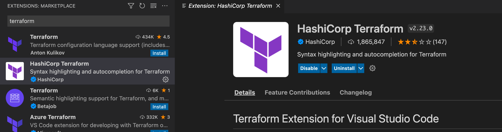

# Introduction

Why Terraform? DevOps is transforming the way we run software, the benefits of *infrastructure as code* is becoming more obvious in how we can provision entire environments without manually needing to do anything, with tests and debugging to help setup idempotence, conventions and distibution in all environments. There is also a concept known as *configuration drift*, where an environment differs from others, and will end up as a snowflak serve. As the company grows, this will become more problematic.

*Statistically*, companies that apply good DevOps practises increase  the number of features delivered by 100%, reduce lead times (the time coming up with an idea to running code in production) by 60%, and reduce production incidents by 60 to 90%.

This is at the heart of chaos engineering and also a very good way of documenting and versioning with speed, safely and reliably. 

# Get Started with Terraform and cloudfoundry

Learn Terraform and Cloudfoundry, an excuse for me to learn Terraform and to solve an infrastructure consistency problem I have been experiencing with an environment I have been developing on.

### Steps for getting started

1. ##### **Download** Terraform from https://www.terraform.io/downloads

   ```bash
   brew tap hashicorp/tap
   brew install hashicorp/tap/terraform
   terraform --version	# >Terraform v1.2.4 on darwin_amd64
   ```

2. Download **cloud foundry [terraform provider](https://github.com/cloudfoundry-community/terraform-provider-cloudfoundry)** which can be done at https://github.com/cloudfoundry-community/terraform-provider-cloudfoundry/wiki like below or do it manually based on the 

   ```bash
   bash -c "$(curl -fsSL https://raw.github.com/cloudfoundry-community/terraform-provider-cloudfoundry/master/bin/install.sh)"
   ```

   

3. Initialise cloudfoundry provider (What does this mean and is it through provider syntax?)

4. Setup an IDE like IntelliJ or *VSCode* with terraform plugins and syntax highlighting 

   

5. TODO ...

### Why Terraform?

- **I**nfrastructure **A**s **C**ode represents a mindset of executing code to *define*, *deploy, update and destroy infrastructure*
- There are 5 categories of IAC tools
  - **Adhoc scripts** - Bash, Ruby Python, Powershell
  - **Configuration management tools** - Chef, Puppet, Ansible and SaltStack
  - **Server templating tools** - Docker, Packer, Vagrant, Virtual Machines or Containers (Immutable infrastructure)
  - **Orchestration tools** - Kubernetes, Marathon, Mesos, Amazon ECS, Docker Swarn or a Pod of Dockers and Nomad
  - **Provisioning tools** - Terraform, Cloud-Formation and Openstack Heat 
- Terraform, wriiten on GI, makes API calls to the relevant API translating one or more providers consistently, defining entire infrastructure - servers, databases
- What Terraform is not, an easy way to just swap between different cloud providers with the same settings, mainly because providers offer different solutions (no easy way to transparently port from one to another)

### How to manage Terraform state

### How to create reusable infrastructure with terraform modules

### Tips, tricks, loops, If statements, Deployment and Gotchas

### How to test Terraform code

### Terraform and the CICD depoloyment process

### The docs

In the root of ths repository, there is an [example.tf](./example.tf) file, that can demonstrate syntax highlighting and some resources by area

- [Cloudfoundry terraform community](https://github.com/cloudfoundry-community/terraform-provider-cloudfoundry/blob/master/docs/index.md) (*Procfile* and *runtime.txt* usually generates some of this)
  - [Cloudfoundry org resource](https://github.com/cloudfoundry-community/terraform-provider-cloudfoundry/blob/master/docs/resources/org.md)
  - [Cloudfoundry space resource](https://github.com/cloudfoundry-community/terraform-provider-cloudfoundry/blob/master/docs/resources/space.md)
  - [Cloudfoundry app resource](https://github.com/cloudfoundry-community/terraform-provider-cloudfoundry/blob/master/docs/resources/app.md)
  - [Cloudfoundry service resource](https://github.com/cloudfoundry-community/terraform-provider-cloudfoundry/blob/master/docs/resources/service_key.md)
  - [Cloudfoundry build pack](https://github.com/cloudfoundry-community/terraform-provider-cloudfoundry/blob/master/docs/resources/buildpack.md) (stored in runtime.txt file in deployed app)

### The videos

- [Terraform Providers for Cloud Foundry - Guillaume Berche, Orange & Mevan Samaratunga, Pivotal](https://www.youtube.com/watch?v=JonQqWHofms)
-  TODO more if any gret resources available

### The book

- **Terraform** *Up & running* writing infrastructure as a code by *Yevgeniy Brakeman*

### Extra links

- https://gruntwork.io/

# Conclusion

Why would anyone go with Terraform on Cloudfoundry? TODO: Summarise key concepts and benefits

