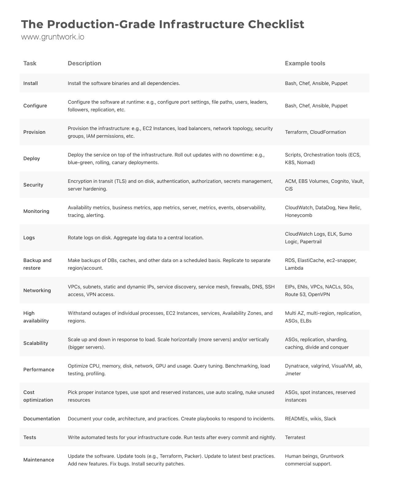

[TOC]

------

# Introduction


Why Terraform? DevOps is transforming the way we run software, the benefits of _infrastructure as code_ is becoming more obvious in how we can provision entire environments without manually needing to do anything, with tests and debugging to help setup idempotence, conventions and distibution in all environments. There is also a concept known as _configuration drift_, where an environment differs from others, and will end up as a snowflake server. As the company grows, this will become more problematic.

_Statistically_, companies that apply good DevOps practises increase the number of features delivered by 100%, reduce lead times (the time coming up with an idea to running code in production) by 60%, and reduce production incidents by 60 to 90%.

This is at the heart of chaos engineering and also a very good way of documenting and versioning with speed, safely and reliably. 

[Cloud Foundry](https://docs.cloudfoundry.org/concepts/overview.html) is the provider I am using, but as you know will be [discontinued](https://techcrunch.com/2021/12/27/whats-next-for-cloud-foundry/) soon. This is my provider and reason for doing this exercise currently, but the same rules can be applied to other providers.


# Get Started with Terraform and cloudfoundry

Learn Terraform and Cloudfoundry, an excuse for me to learn Terraform and to solve an infrastructure consistency problem I have been experiencing with an environment I have been developing on.

### Steps for getting started

1. ##### **Download** Terraform from https://www.terraform.io/downloads

   ```bash
   brew tap hashicorp/tap
   brew install hashicorp/tap/terraform
   terraform --version	# >Terraform v1.2.4 on darwin_amd64
   ```

2. Create a **provider script** requiring and restricting the version of terraform downloaded, as well as the latest [cloud foundry provider](https://registry.terraform.io/providers/cloudfoundry-community/cloudfoundry/latest)

   ```haskell
   required_providers {
       cloudfoundry = {
         source = "cloudfoundry-community/cloudfoundry"
         version = "0.15.3"
       }
     }
   ```

3. Initialise cloudfoundry provider `terraform init`

   

4. Setup an IDE like Intelli-J or _VSCode_ with terraform plugins and syntax highlighting

   

### Why Terraform?

- **I**nfrastructure **A**s **C**ode represents a mindset of executing code to _define_, _deploy, update and destroy infrastructure_
- There are 5 categories of IAC tools
  - **Adhoc scripts** - Bash, Ruby, Python, Powershell
  - **Configuration management tools** - Chef, Puppet, Ansible and SaltStack
  - **Server templating tools** - Docker, Packer, Vagrant, Virtual Machines or Containers (Immutable infrastructure)
  - **Orchestration tools** - Kubernetes, Marathon, Mesos, Amazon ECS, Docker Swarn or a Pod of Dockers and Nomad
  - **Provisioning tools** - /Users/farahvi/Dev/uktrade/rtfm/docs/playbooks/dnb-service.rst
- Terraform is written in Go, makes API calls to the relevant **API translating** one or more _providers_ consistently, defining entire infrastructure - servers, databases using **H**ashiCorp **C**onfiguration **L**anguage
- What **Terraform is not**, an easy way to just swap between different cloud providers with the same settings, mainly because providers offer different solutions (no easy way to transparently port from one to another)
- Terraform uses a **declarative** approach, meaning it declares how the _desired state_ or end result, where as Puppet uses a **procedural** approach, so it may change what exists versus what you knewly configured
- Procedural approaches also do not take into the account the state and history of the infrastructure, but the down side is that declaritive has no concept of _zero-downtime deployments_ but clever hacks to solve this
- Terraform is one of the youngest IaC tools, making it the least mature

### Getting started with Terraform

- The extension is <file>.tf calling **provider**s like AWS, Azure and [Cloudfoundry](https://github.com/cloudfoundry-community/terraform-provider-cloudfoundry/blob/master/docs/index.md) `provider "<NAME>"`

  ```haskell
  provider "cloudfoundry" {
  		[CONFIG ...]
  }
  ```

  

- For each type of provider **resource**s the provider type and name `resource "<PROVIDER_TYPE>" "<NAME>"`

  ```haskell
  resource "cloudfoundry_space" "s1" {
      [CONFIG ...]
  }
  ```

- **Reference**s allow you to access other parts of the code `<PROVIDER>_<TYPE>.<NAME>.<ATTRIBUTE>`

- **Variable**s `variable "<NAME>" {[CONFIG ...]}` and configure some information about the variable like below, and type can consist of a *string, number, bool, list, map, set, object, tuple and any* 

  ```haskell
  variable "api_url" {
      description = "API URL"
      type = string
      default = "https://api.london.uk"
  }
  var.api_url
  ```

- **Data** source, like resource but the name is used as an identifier `data "<PROVIDER_TYPE>" "<NAME>" {[CONFIG ...]}`

  ```haskell
  data "cloudfoundry_app" "my-app" {
      name_or_id = "my-app"
      space      = "space-id"
  }
  data.my_app.buildpack
  ```

- **Output** variables `output "NAME" { value = "<PATH>"}`

  ```haskell
  output "s3_bucket_arn" {
    value       = aws_s3_bucket.terraform_state.arn
    description = "The ARN of the S3 bucket"
  }
  ```

- **Terraform Actions** `terraform -help`

  - `terraform init` Initialise within the folder

  - `terraform validate` check configuration

  - `terraform plan` Run assigning variable values and see what will happen without making any changes

  - `terraform apply` This create or update existing

  - `terraform destroy` Destroy previous infrastructure or cleanup, no undo in production and will destroy all resources, so don't do this in production

  - `terraform graph` Create a dependency graph to see what you create

  

- **Note** Terraform keeps track of the **state** or resources that are already deployed. Setup gitignore if you don't want that stored in GIT

  

### How to manage Terraform state

- Every time terraform is applied, it records information about the **infrastructure** to *terraform.tfstate* file

- The state file is a **private API** (only used internally) and should very rarly be manipulated

- In a team dynamic, utilise **lock file**s

- *Don't* store state in **source control**, will share secrets and other as open text

- Configure **remote backends** with *secrets* to store this like a secured S3 (Simple storage service 99.99% availibilty and durability)

  - ***Limitation*** is a chicken-and-egg situation where this needs to be divided into two steps and same when deleting

- Seperate terraform files to help debug issues, placing in seperate folders or files and **Isolate** via workspaces or file layout

  ```haskell
  terraform workspace new workspace1
  terraform wokspace list #defaut workspace1
  ```

### How to create reusable infrastructure with terraform modules

- Need at least two nearly identical **environments**, *staging* and *production*

- **Module**s are any files in a folder is a module `module "<NAME>" {sourc = "<SOURCE>"}`

  ```haskell
  module "web_cluster" {
    cluster_name  = var.cluster_name
    instance_type = "m4.large"
    ...
  }
  
  resource "aws_autoscaling_schedule" "scale_out_during_business_hours" {
    scheduled_action_name  = "scale-out-during-business-hours"
  	...
    autoscaling_group_name = module.web_cluster.asg_name
  }
  ```

- Module **locals** by referencing `local.<name>` `locals{<key> = <value>}`

  ```haskell
  locals {
    tcp_protocol = "tcp"
    all_ips      = ["0.0.0.0/0"]
  }
  
  resource "aws_security_group_rule" "allow_server_http_inbound" {
    type        = "ingress"
    ...
    protocol    = local.tcp_protocol
    cidr_blocks = local.all_ips
  }
  ```

- **Module versioning** can also be done by referencing the module source=<url>?ref=v<major>.<minor>.<patch>

### Tips, tricks, loops, If statements, Deployment and Gotchas

In a declarative language, this is how primitives are defined

- Terraform offers several looping constructs

  - **count** parameter to loop over resources but not inline loops

    ```haskell
    resource "<PROVIDER>_<TYPE>" "<NAME>" {
    	count = 3
    	name = "user_${count.index}"
    }
    ```

  - **for_each** expressions, to loop over resources and inline blocks within a resource

    ```haskell
    resource "<PROVIDER>_<TYPE>" "<NAME>" {
    	for_each = toset(var.user_names)
    	name = each.value
    }
    ```

  - **Array lookup** syntax or **length** function <PROVIDER>_<TYPE>.<NAME>[INDEX].ATTRIBUTE

    ```haskell
    variable "user_names" {
    	type = list(string)
    	default = ["neo", "morpheus"]
    }
    var user_names[1]
    count = length(user_names)
    ```

  - **Dynamic** for generating inline blocks

    ```haskell
    dynamic "<VAR_NAME>" {
    	content {
    		...
    	}
    }
    
    resource "aws_autoscaling_group" "example" {
    	...
    	dynamic "tag" {
    		for_each = var.custom_tags
    		contant {
    			key 	= tag.key
    			value = tag.value
    			propagate_at_launch = true
    		}
    	}
    }
    ```

  - **Loops with expressions** like [for <ITEM> or <KEY>,<VALUE> in <LIST> : <OUTPUT>]

    ```haskell
    variable "names" {
    	type 		= list(string)
    	default	= ["name_1", "name_2"]
    }
    
    output "upper_names" {
    	value = [for name in var.names: upper(name)]
    }
    
    or
    
    output "bios" {
    	value = [for name, role in var.supervisors: "${name} is in the ${role}"]
    }
    ```

  - **Loops with string directive** allow reference to code`%{ for <ITEM> in <COLLECTION> }<BODY>%{endfor}`

    ```haskell
    output "for_directive_remove_marker" {
    	value = <<EOF
    	%{~ for name in var.names}
    		${name}
    	%{~ endfor}
    	EOF
    }
    ```

  - **Conditionals** can be ued with all the loops above differently as *ternary* style values

    ```
    variable "is_enabled" {
    	type	= bool
    }
    # So setting count to 0 will generate nothing
    resource "some_resource" {
    	count = var.is_enabled ? 1 : 0
    }
    ```

  - **Conditionals** with the if String Directive `%{ if <CONDITION> }<TRUEVAL>%{ else }<FALSEVAL>%{ endif }`

    ```haskell
    variable  "name" {
    	type = string
    }
    
    output "if_else_directive" {
    	value = "Hello, %{ if var.name != "" }${var.name}%{ else }(unamed)%{ endif }"
    }
    ```

  - **Zero-Down deployment** to *update* a clusterso no down time will occur e.g. **A**mazon **M**achine **I**mage

    1. Expose the <Type> as an **input variable** in either a module/service/webseverver-cluster/vairiable.tf

       ```haskell
       variable "server_text" {
       	description = "The AMI to run within the cluster"
       	...
       }
       ```

    2. Create adata segment to load data from from a shell script

       ```haskell
       data "template_file" "user_data" {
       	template = file("${path.module}/user-data.sh")
       	vars = {
       		server_port = var.server_port
       		db_address  = data.terraform_remote_state.db.outputs.address
       		db_port  		= data.terraform_remote_state.db.outputs.port
           server_text = var.server_text		
       	}
       }
       ```

    3. Launch a resource with the *main.tf* file referencing the above template file *user_data* to store

       ```haskell
       resource "aws_launch_config" "example" {
       	image_id 		= var.ami
       	...
       	user_data 	= data.template_file._user_data
       	lifecycle {
       		create_before_destroy = true			
       	}
       }
       ```

    4. The problem is at the point there would be downtime, because of the above *lifecycle*, by configuring the name parameter with a replacement so the *create_before_destroy* event will replace (make sure you set the *min_elb_capacity*)

       ```haskell
       		resource "aws_autoscaling_group" "example" {
       			name= "Something with the ASG name that gets replaced"
       			...
       			min_elb_capcity = var.min_size # Wait for health checks
       			...
       		}
       ```

- Terraform does have **limitations** on count and for_each, zero-downtime deployment, and valid plans can fail, refactoring can be tricky

- If you want to ***change identifiers** without accidently deleting  and recreating resources, you will have to change the state file (anti pattern doing this and should rarely be done)

- Some cloud providers are **asynchronous**, therefore making it problematic to get resources until they are created. It takes time, especially when a new type is created, just rerun *terraform.apply*

### Production-Grade Terraform Code

- *1 -2 weeks*, minimum for MYSQL using AWS RDS to be production ready

- *2-4 weeks* Node JS with **A**uto **S**caling **G**roup

- *2-4 months* with Amazon ES

- *6 - 36 months* for entire architecture including apps, datastore, load balancers, monitoring, alerting, security ...

  

- **Why** does it take so long?

  - [**Cone of uncertainty**](https://en.wikipedia.org/wiki/Cone_of_Uncertainty) with devops projects usually doubles
  - Devops is still an industry in the **stone ages**, meaning *Terraform, Kubernetes, Docker, Packer* only released in 2010's
  - **Yak shaving**, or all the small and unrelated taks that must be done before you can do the one you wanted to do in the first place, the consequence of the immaturity of devops tech, tight coupling and duplication of infrastructure or **accidental complexity**
  - **Essential complexity**, a genuinly long checklist for tasks that need to be done to prepare infrastructure

- **Production grade checklist**

  

- Production grade **modules**:

  - **Small** modules: 

    - Single file, single module is defined as an bad idea
    - Large Modules, > 100 lines are considered slow, risky, difficult to read to understand, review and test
    - The **Principle of Least Privilege** states that a subject should be given only those privileges needed for it to complete its task

  - **Composable** modules

    - Small composable lego blocks sharing areas repeated into modules, try not to duplicate concepts

    - Create a modules folder in the root with a generic area folder and specific instance folder containing main, outputs, variables and readme

      

    - **Referencing** the module can be done through relative pathing and the source argument and the variables used in the referenced modules

      ```haskell
      module "rolling-deploy" {
        source = "../../modules/cluster/asg-rolling-deploy"
      	...
      	ami 					= var.ami #variable from module
      	cluster_name 	= var.cluster_name #variable from module
      }
      ```

    - Terraform will be made of **two types of modules** 

      - **Generic** Modules as basic building blocks, reusable to support composition and reuse
      - **Use-case-specific** Like a specific application mixed with generic modules to service one specific use

  - **Testable** modules

    - **Manual test harness** by using `terraform init` and `apply` to check for errors
    - **Automated test harness**, see below for more details, done within a test folder
    - **Executable documentation** by ading a README into every folder so its easy for your team to understand
    - **Version pinning** or `required_version` and `terraform` element attribute. Plan the version even more strictly for production

  - **Releasable** modules

    - `terraform apply` will deploy a versioned module i.e. if you use a `?ref` to version a module checked into a public github repo by a tag

      ```haskell
      module "webserver_cluster" {
        source = "github.com/brikis98/terraform-up-and-running-code//code/terraform/04-terraform-module/module-example/modules/services/webserver-cluster?ref=v0.3.0"
      
      ```

    - The repo must be **named** terraform-<PROVIDER>-<NAME>

    - The module must follow a **specific file structure**, including defining Terraform code in the root of the repo, prividing a *README*, and using the conventions of *main.tf, variables.tf and outputs.tf*

    - The repo must use **Git tags** with semantic versioning

### How to test Terraform code

- Devops has fear for downtime, data loss or security breaches

- The goal of testing is to give confidence of changes

- Manual tests

  - When testing Terraform, there is **no localhost**, therefore deploying to real environments
  - `terraform.apply` deploys the  code and you can use [*curl*](https://curl.se/) to test responses
  - **Validate infrastucture** using tools appropriate for viewing content like a postgress db
  - Every team should setup an **isolated sandbox** environment so multiple team members
  - **Cleaning up** after tests, especially in sandbox environments can be done using `terraform destroy`
    - Cloud-nuke and AWS
    - Janitor Monkey and the Simian Army Chaos monkey tools (not maintained)
    - Aws-nuke

- Automated tests

  - **Unit tests**: What is a unit in the Terraform world and that is a single composable module

    - You would probably want to test with something that can give HTTP Server request response stuff

    - You can't do pure unit testing with terraform, ie they are *integration tests*

    - **Strategy** for writing the test is:

      1. Create generic standalone module
      2. Create an easy to deploy module
      3. `terraform apply` it into a real environment
      4. Validate that it worked and with the specific type of infrastructure and ask how would I have tested it manually to get it to work
      5. `terraform destroy` to clean up

    - [**Install GO**](https://go.dev/doc/install) language

      - [Get started](https://go.dev/doc/tutorial/getting-started) with go tutorial will help setting up the basics

      - Learn some more basic go syntax at https://www.w3schools.com/go/index.php

      - You must have [Terraform](https://www.terraform.io/) installed on your computer.

      - Many other instructions, details in the link above

        ```go
        // go_sanity_test.go
        package test
        
        import (
        	"fmt"
        	"testing"
        	"github.com/stretchr/testify/require"
        )
        
        func TestGoIsWorking(t *testing.T) {
        	fmt.Println()
        	fmt.Println("If you see this text, it's working!")
        	fmt.Println()	
        	var actual bool = true
        	require.Equal(t, actual, true)
        	require.not.Equal(t, actual, false))	
        }
        
        // go test go_sanity_test.go
        ```

      - A real AWS test as an example

        ```go
        package test
        
        import (
        	"fmt"
        	"github.com/stretchr/testify/require"
        
        	"github.com/gruntwork-io/terratest/modules/http-helper"
        	"github.com/gruntwork-io/terratest/modules/random"
        	"github.com/gruntwork-io/terratest/modules/terraform"
        	"testing"
        	"time"
        )
        
        func TestAlbExample(t *testing.T) {
        
        	t.Parallel()
        
        	opts := &terraform.Options{
        		// You should update this relative path to point at your alb
        		// example directory!
        		TerraformDir: "../examples/alb",
        
        		Vars: map[string]interface{}{
        			"alb_name": fmt.Sprintf("test-%s", random.UniqueId()),
        		},
        
        	}
        
        	// Clean up everything at the end of the test
        	defer terraform.Destroy(t, opts)
        
        	// Deploy the example
        	terraform.InitAndApply(t, opts)
        
        	// Get the URL of the ALB
        	albDnsName := terraform.OutputRequired(t, opts, "alb_dns_name")
        	url := fmt.Sprintf("http://%s", albDnsName)
        
        	// Test that the ALB's default action is working and returns a 404
        	expectedStatus := 404
        	expectedBody := "404: page not found"
        	maxRetries := 10
        	timeBetweenRetries := 10 * time.Second
        
        	http_helper.HttpGetWithRetry(
        		t,
        		url,
        		nil,
        		expectedStatus,
        		expectedBody,
        		maxRetries,
        		timeBetweenRetries,
        	)
        }
        ```

      - The book contains Ruby examples and many others to Deploy

- E2e tests  and integration tests need to follow the test pyramid structure to maintain cost and speed

  

### How to use Terraform as a team


### Terraform and the CICD deployment process

# Learning Resources

### The Cloud Foundry Provider docs

In the root of ths repository, there is an [example](./example) file, that can demonstrate syntax highlighting and some resources by area

- [Cloud Foundry terraform community](https://github.com/cloudfoundry-community/terraform-provider-cloudfoundry/blob/master/docs/index.md) (_Procfile_ and _runtime.txt_ usually generates some of this) https://registry.terraform.io/providers/cloudfoundry-community/cloudfoundry/latest/docs
  - [**org** resource](https://github.com/cloudfoundry-community/terraform-provider-cloudfoundry/blob/master/docs/resources/org.md)
  - [**space** resource](https://github.com/cloudfoundry-community/terraform-provider-cloudfoundry/blob/master/docs/resources/space.md)
  - [**app** resource](https://github.com/cloudfoundry-community/terraform-provider-cloudfoundry/blob/master/docs/resources/app.md)
  - [**service** resource](https://github.com/cloudfoundry-community/terraform-provider-cloudfoundry/blob/master/docs/resources/service_key.md)
  - [**build pack**](https://github.com/cloudfoundry-community/terraform-provider-cloudfoundry/blob/master/docs/resources/buildpack.md) (stored in runtime.txt file in deployed app)

### The videos

- [Terraform Providers for Cloud Foundry - Guillaume Berche, Orange & Mevan Samaratunga, Pivotal](https://www.youtube.com/watch?v=JonQqWHofms)

### The book

- **Terraform** _Up & running_ writing infrastructure as a code by _Yevgeniy Brakeman_

### Extra links

- https://github.com/cloudfoundry-community/terraform-provider-cloudfoundry/tree/master/examples/ldap

- https://github.com/brikis98/terraform-up-and-running-code/tree/2nd-edition/code/terraform

- https://gruntwork.io/

- https://www.clickittech.com/devops/terraform-vs-cloudformation

- [Why cloudfoundry will be replaced soon](https://www.cloudfoundry.org/governing-board/)

- https://gds.blog.gov.uk/2022/07/12/why-weve-decided-to-decommission-gov-uk-paas-platform-as-a-service/

- https://aws.amazon.com/blogs/containers/introducing-aws-copilot/

# Conclusion

Why would anyone go with Terraform on Cloudfoundry? The declaritive syntax is easy to work with and the state and end result is easy to understand. There are several gotchas that you will need to stumble into with experience, some issues about always being behind some providers but the end result is worth learning so you can provide the same experience with several huge providers
